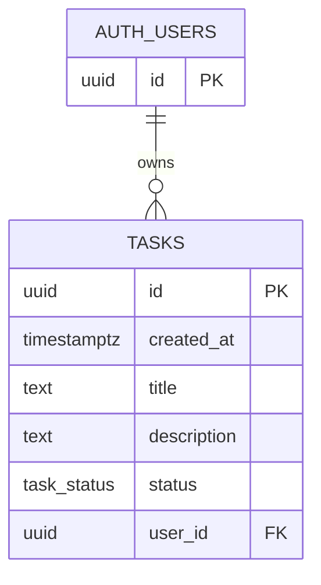

# ERD — To-Do List API

## Notas

- A FK `tasks.user_id -> auth.users.id` garante integridade do dono da tarefa.
- O isolamento por usuário é garantido via **RLS** com `auth.uid() = user_id` (ver `supabase/sql/001_tasks_rls.sql`).

